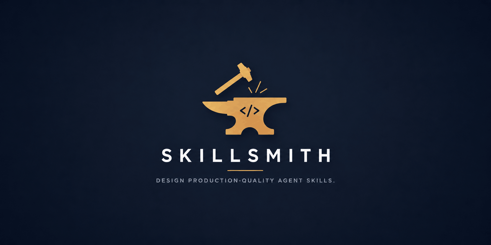

<p align="center">
  
</p>

<h1 align="center">Skillsmith</h1>

<p align="center">
Design Production-Quality Agent Skills.
</p>

<p align="center">
  
  
  
</p>

Skillsmith is an open-source Agent Skill that helps AI agents design, review, and generate high-quality skills following the official Agent Skills specification.

Rather than focusing solely on generating `SKILL.md` files, Skillsmith emphasizes software engineering principles such as modularity, progressive disclosure, single responsibility, maintainability, and token efficiency.

## **Features**

* 🏗️ Designs reusable, production-quality Agent Skills
* 📦 Encourages modular architecture and progressive disclosure
* 🔍 Reviews skills for common design issues before returning them
* 📚 Includes concise reference material for validation and design patterns
* ⚡ Optimized for low token usage without sacrificing capability

## **Repository Structure**

```
skillsmith/
├── SKILL.md
└── references/
    ├── constraints.md
    ├── patterns.md
    └── skill-smells.md
```

## **Philosophy**

A good skill should be:

* Reusable
* Discoverable
* Modular
* Composable
* Maintainable
* Deterministic
* Token-efficient

Skillsmith is built around these principles.

## **What’s Included**

### **`SKILL.md`**

The primary meta-skill responsible for designing and generating new Agent Skills.

### **`references/constraints.md`**

A compact reference of the Agent Skills specification used during validation.

### **`references/patterns.md`**

Common architectural patterns for organizing different types of skills.

### **`references/skill-smells.md`**

A review checklist of common design mistakes and anti-patterns.

## **Usage**

Place the `skillsmith` directory into your agent’s skills directory and allow the agent to discover it according to your agent framework’s conventions.

When activated, Skillsmith helps agents:

* create new skills
* refactor existing skills
* review skill architecture
* organize supporting documentation
* apply progressive disclosure
* improve maintainability and discoverability

## **Contributing**

Discussions, issues, suggestions, and pull requests are welcome.

If you discover opportunities to improve skill architecture, progressive disclosure, or token efficiency, please open an issue or submit a pull request.
